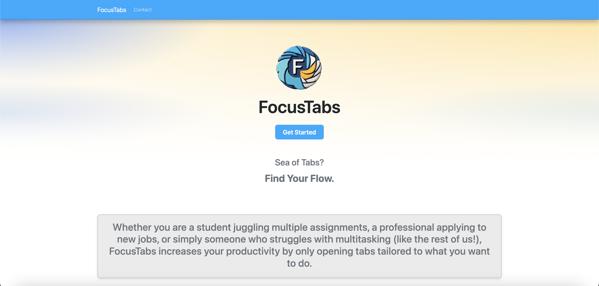
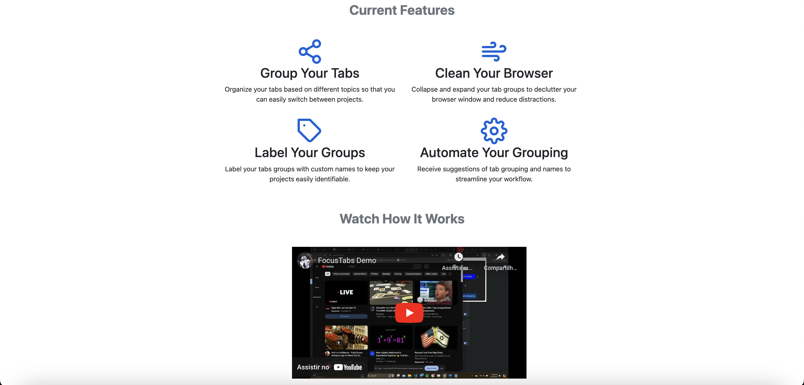

# [FocusTabs' Landing Page](https://focus-tabs.com/)

## Demo
Visit the [repository](https://github.com/guifeitosabr/s24-team-09-landing-page) for source code and project management.

## Description
The landing page was built to promote "FocusTabs," a Chrome extension that allows users to group their tabs—either manually or automatically—and hence increase their productivity online. It uses the [hugo-bootstrap-theme](https://github.com/filipecarneiro/hugo-bootstrap-theme) by Filipe Carneiro as a template.

## Visuals
Below are images of the landing page:

- 
- 

## Requirements
The tools used are cross-platform and should work on Windows, MacOS, and Linux. You will need the following tools downloaded and installed:

1. [**Hugo static site builder**](https://github.com/gohugoio/hugo/releases) - IMPORTANT: make sure you pick the extended version, Hugo_extended_0.xx.x…
2. [**Node & NPM**](https://nodejs.org/) - We use this to maintain project dependencies.
3. [**Git**](https://git-scm.com/downloads) - This is optional, but highly recommended for version control and remote backups.

## Installation
```bash
git clone https://github.com/guifeitosabr/s24-team-09-landing-page.git
```

## Usage
Refer to the "README.md" at Filipe Carneiro's [hugo-bootstrap-theme](https://github.com/filipecarneiro/hugo-bootstrap-theme) as reference.

## Team and Acknowledgment

* **Authors**: Anirudh Bharadwaj, Eshan Singhal, Guilherme Feitosa, and Kofi Addae-Sakyi.
* **Acknowledgments**: We would like to thank Professor [Jérémie O. Lumbroso](https://github.com/jlumbroso) for his fundamental mentorship all throughout the development of FocusTabs. Likewise, all four of us would like to extend our gratitude to [Filipe Carneiro](https://github.com/filipecarneiro), who spearheaded the landing page we used as a template for ours.

## Contact
If you have any questions about the landing page, please, feel free to open an issue [here](https://github.com/guifeitosabr/s24-team-09-landing-page/issues/new).